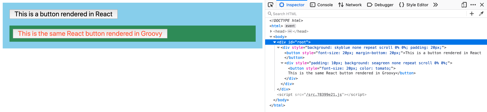

groovy-react
================

Proof of concept for compiling a Groovy DSL into React components.

There are two steps to the build process:

- compile Groovy code into Javascript files
- create and serve the bundle using Parcel

This allows you to use React components in Groovy components. Then use the compiled Groovy components in a React application.



# Development

```bash
git clone https://github.com/littlemooon/groovy-react
cd groovy-react

# install dependencies
npm i

# build groovy and bundle with parcel
npm run dev

open http://localhost:4000
```
